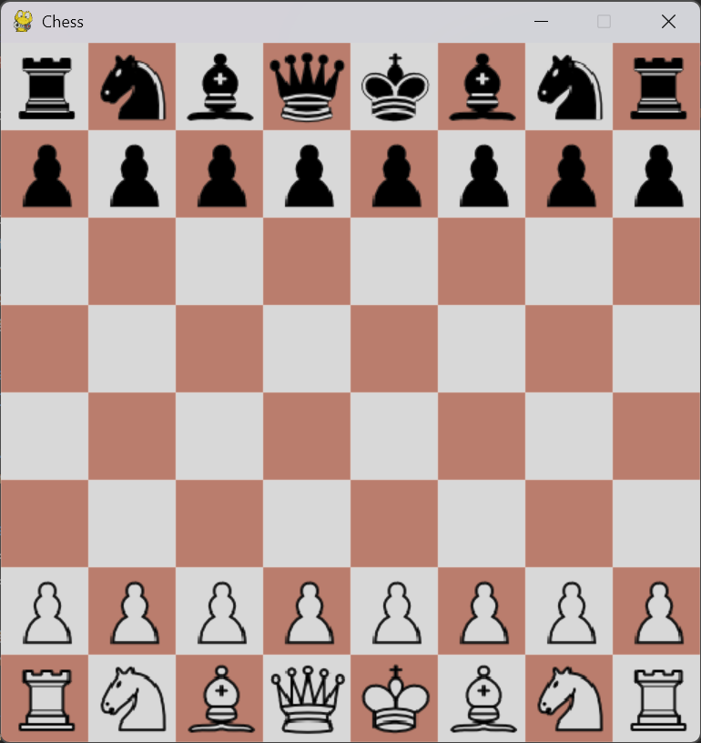
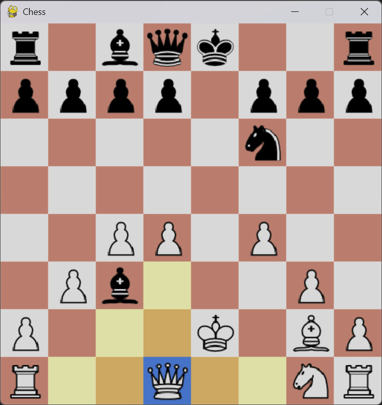

# AI-Chess

## Overview

AI Chess is a simple chess game implemented in Python using the Pygame library. It provides a graphical user interface for playing chess against an AI opponent.

## Features

- Human vs. AI gameplay
- Undo and restart options
- Animated piece movements
- Checkmate and stalemate detection
- Graphical chessboard with piece images

## How to Play

1. Clone the repository to your local machine.
   ```bash
   git clone https://github.com/YourUsername/AI-Chess.git
   ```

2. Install the required dependencies (Pygame).
   ```bash
   pip install pygame
   ```
   ```bash
   pip install numpy
   ```

3. Run the main script to start the game.
   ```bash
   python ChessMain.py
   ```

4. Use the mouse to click and make moves on the chessboard.
   - Press 'z' to undo the last move.
   - Press 'r' to restart the game.

## Screenshots

#### Start Game Image


#### Mid Game Image


## Project Structure

- `ChessMain.py`: Main script for the Pygame implementation.
- `ChessEngine.py`: Chess engine providing the game state and move logic.
- `AIPlayer.py`: AI player using the minimax algorithm for move decisions.
- `Images/`: Folder containing chess piece images.

## Contributing

If you'd like to contribute to this project, please follow these guidelines:

1. Fork the repository.
2. Create a new branch.
3. Make your changes and commit them.
4. Push to your fork and submit a pull request.

---

### Happy gaming!
